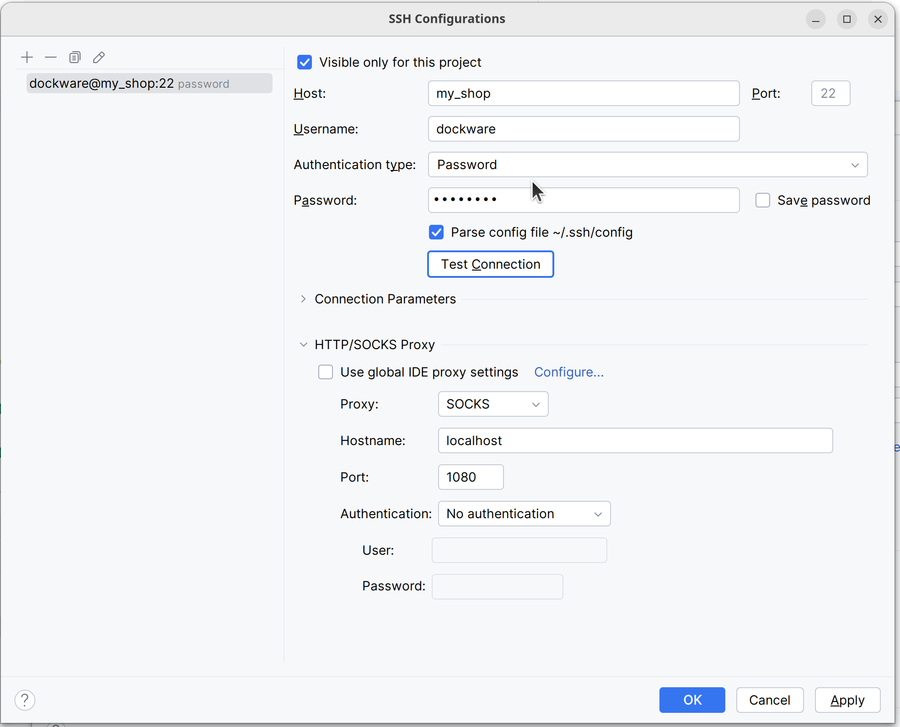
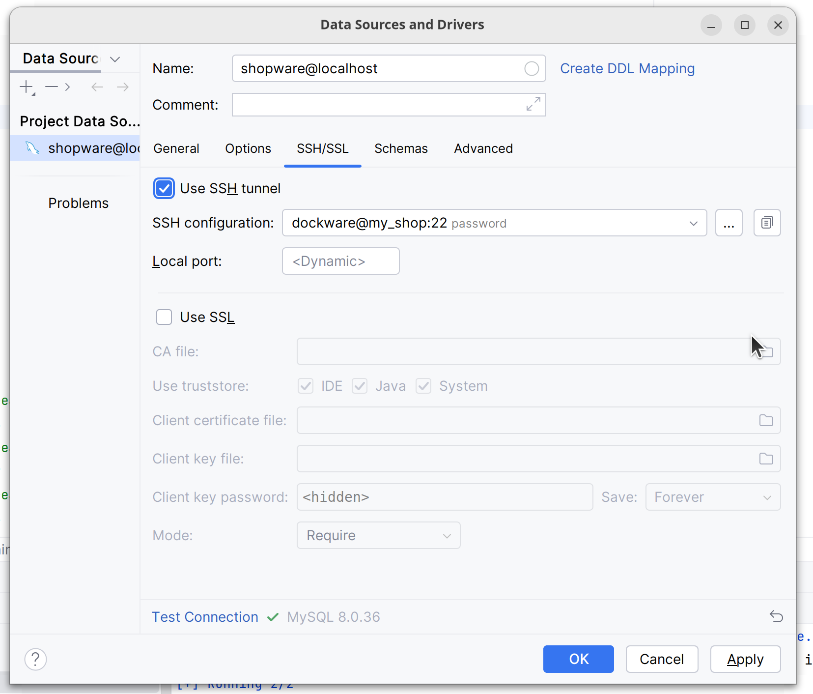

# Dockware Proxy

This guide helps you to run multiple dockware instances and access them by different domain names.

### 1. Create network for all future dockware containers
```bash
docker network create  --driver=bridge --subnet=172.30.0.0/16 web
```
### 2. Start dockware-proxy 
Clone this repository and cd into it.
```bash
git clone https://github.com/rohithmeethal/dockware-proxy.git
cd dockware-proxy
docker compose up -d
```

This starts caddy proxy and socks proxy services.

1. Caddy proxy is: https://github.com/lucaslorentz/caddy-docker-proxy
2. Socks proxy is: https://github.com/serjs/socks5-server


Caddy proxy helps to automatically create a reverse proxy for each container with a label to domain name mapping.
You can read more about caddy proxy in the link above.

Socks proxy is used to access ssh and mysql services of the container. 

### 3. Add trusted proxy to dev environment
```yaml
# config/packages/dev/symfony.yaml
framework:
  trusted_proxies: '127.0.0.1,172.30.0.0/16'
```
### 4. Adjust projects docker-compose.yml
In the following configuration container is named `my_shop` and domain name is `my_shopware.localhost`.
We use `.localhost` domain which will automatically be resolved to `127.0.0.1` by modern operating systems.

We use caddy labels to domain name and port mapping.
If you have more than one shop inside shopware, these can be exposed through another domain name, you just need to add more labels just like the first domain.

> Please note we use label to map only apache and watcher ports. For accessing mysql and ssh we use socks proxy, this is later in the guide.

> Please note we have to use the same network (web) as dockware-proxy to make it work. make sure it is set to `external: true`
```yaml
version: "3"

services:
  shopware:
    volumes:
      - "db_volume:/var/lib/mysql/"
    image: dockware/dev:6.6.2.0
    container_name: my_shop
    expose:
      - 80   # Apache
      - 22   # SSH
      - 8888 # Admin watcher
      - 9999 # Storefront watcher
      - 9998 # Storefront watcher
      - 3306 # MySQL
    networks:
      - web
    labels:
      caddy_0: my_shop.localhost
      caddy_0.reverse_proxy: "{{upstreams 80}}"
      caddy_1: my_shop.localhost:8888
      caddy_1.reverse_proxy: "{{upstreams 8888}}"
      caddy_2: my_shop.localhost:9999
      caddy_2.reverse_proxy: "{{upstreams 9999}}"
      caddy_3: my_shop.localhost:9998
      caddy_3.reverse_proxy: "{{upstreams 9998}}"
    restart: unless-stopped
volumes:
  db_volume:
networks:
  web:
    external: true
```
Start the container by running the following command in the project directory. (You might have to run `docker compose down` before running the following command, if your project is already running)
```bash
docker compose up -d
```

#### Now you can access your shop from https://my_shop.localhost (You have to accept the self-signed certificate to access the shop)
> Please note you have to go to admin panel and change sales channel domain to `https://my_shop.localhost` to access the storefront.

### 5. Accessing SSH

To access ssh service of the container, you can use socks proxy. Assuming you are phpstorm you can configure by follwing steps:
1. Goto [File | Settings | Tools | SSH Configurations](jetbrains://PhpStorm/settings?name=Tools--SSH+Configurations)
2. Add new configuration by clicking on `+` sign
3. Fill in the details as shown in the image

> Please note host is name of the container, in our case it is `my_shop`. SSH username and password dockware defaults. Make sure you have added SOCKS proxy as shown in the image.
4. Click on `Test Connection` to verify the connection

### 6. Accessing MySQL

To access mysql service of the container, you can use ssh tunneling using the ssh configuration we created in the previous step.



